# 1HandIndia In-Memory Storage, Search, and Database Wireflow

**Project:** 1HandIndia Multi-Vendor Ecommerce Marketplace  
**Scope:** Current implemented code and locked architecture notes  
**Generated From:** `prisma/schema.prisma`, `apps/api`, `apps/web`, `apps/worker`, and planning documents  
**Last Reviewed:** 2026-06-08

## 1. Short Answer

1HandIndia does not use in-memory storage as the main database.

The business source of truth is PostgreSQL through Prisma. Users, sellers, products, carts, orders, payments, payouts, B2B enquiries, CMS content, notification logs, settings, and audit logs are persisted in database tables.

In-memory storage is used only for temporary runtime work:

- Browser-side React Query cache.
- API process-local rate-limit buckets.
- Temporary Maps inside service methods for grouping, lookup, and calculations.
- Redis-backed BullMQ jobs when `REDIS_URL` is configured for non-search background work.

Search is PostgreSQL-backed. Advanced storefront search uses `SearchDocument` rows, a generated `tsvector` column, GIN full-text indexes, `pg_trgm` indexes, cursor pagination, and DB-backed `SearchIndexJob` rows. Redis is not used for search indexing, search caching, or search rate limiting.

## 2. In-Memory Storage Usage

### 2.1 Browser Memory

The web app uses TanStack React Query in `apps/web/src/components/providers.tsx`.

Current behavior:

- Query results are cached in browser memory.
- Default stale time is `30_000` ms.
- `refetchOnWindowFocus` is disabled.
- Cache is lost on full page reload or browser close.
- This is not a database and not shared between users.

Used for:

- Storefront product/cart/account queries.
- Seller dashboard/profile/products/orders.
- Admin, finance, B2B, delivery, CMS, locations, and notifications pages.

Wireflow:

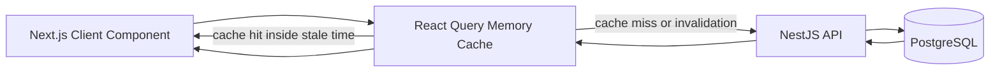

### 2.2 API Process Memory

`apps/api/src/rate-limit/request-rate-limiter.ts` uses a process-local `Map<string, RateLimitEntry>`.

What it stores:

- A hashed identity key.
- Current request count.
- Reset timestamp.

Policies include:

| Policy | Current Purpose |
|---|---|
| `auth` | Login/auth endpoints |
| `admin` | Back-office/admin and finance endpoints |
| `checkout` | Cart, checkout, customer order endpoints |
| `productDetail` | Product detail reads |
| `searchAnonymous` | Anonymous product search |
| `searchAuthenticated` | Authenticated product search |
| `searchSuggestionsAnonymous` | Anonymous search suggestions |
| `searchSuggestionsAuthenticated` | Authenticated search suggestions |
| `public` | Other public API traffic |

Important limitation:

- This Map is per running API process.
- It clears on API restart.
- It does not automatically share counters across multiple API instances.
- Nginx/CDN limits are the shared production protection layer.
- Redis is not required for search rate limiting in the current implementation.

Wireflow:

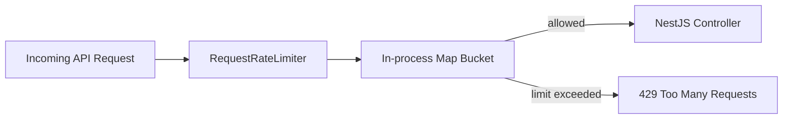

### 2.3 Redis and BullMQ

Redis is used only when `REDIS_URL` is configured.

Current implemented queue:

- `email.notifications`

Worker scaffold also lists future non-search queue names:

- `reports.basic`
- `audit.rollups`
- `future.integration-retries`

Current important behavior:

- API creates a BullMQ queue through `NotificationQueueService`.
- The queued email payload removes provider config before adding the job.
- Worker reads jobs from Redis.
- Worker reads the durable `NotificationLog` from PostgreSQL.
- Worker updates `NotificationLog` status in PostgreSQL.
- Duplicate delivery protection uses a DB delivery lock in `providerMessageId`.

Redis is queue memory, not the permanent notification database.

Wireflow:

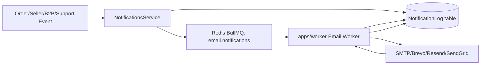

### 2.4 Temporary Service Maps

Several services use `Map` as temporary function-level lookup tables. These are not storage layers.

Examples:

| Area | Map Usage |
|---|---|
| Payment/settings/storage services | Convert DB settings rows into quick lookup maps |
| Products/storefront | Preserve product ordering after raw SQL returns ranked IDs |
| Orders/delivery routing | Calculate partner workload, COD exposure, and recent assignment |
| Finance calculator | Cache commission-rule lookup inside one calculation |
| Location importers | Deduplicate CSV-derived states, cities, and areas during import |
| Notifications | Group last sent/failure counts by trigger |

These Maps are safe for short-lived computation, but they are not persistent and should not hold business-critical state.

### 2.5 Data Not Stored In Memory

These must remain PostgreSQL-backed:

- Users, roles, permissions, admin sessions.
- Customer profiles, addresses, carts, wishlist.
- Sellers, seller profile, seller documents, payout profile.
- Products, variants, stock, inventory movement.
- Orders, payments, delivery, status events.
- COD collection and finance verification.
- Settlements, payouts, ledger, statements.
- B2B enquiries and responses.
- CMS pages, banners, homepage sections, SEO entries.
- Notification logs and email settings.
- Platform settings and audit logs.

## 3. Search Implementation

### 3.1 Public Storefront Advanced Search

Public storefront search starts from the web search page:

```text
/search?q=keyword
```

The web page renders `StorefrontSearchClient`, then calls:

```text
GET /api/search?q=keyword&limit=24
GET /api/search/suggestions?q=keyword&limit=8
```

Backend path:

```text
SearchController.search
  -> SearchService.search
  -> SearchDocument ranked SQL
  -> hydrate returned product/store/category IDs
```

Search SQL uses:

- `SearchDocument.search_vector`, generated from title, subtitle, and search text.
- `websearch_to_tsquery('simple', q)`.
- GIN full-text index on `search_vector`.
- `pg_trgm` indexes on normalized title, subtitle, and search text.
- Exact title, prefix, full-text rank, trigram similarity, stock, deal, rating, review, and freshness boosts.

Only valid public entities are returned:

- Product/store/category search documents must be `VISIBLE`.
- Products must be active, approved, not deleted, in an active category, and sold by an approved seller.
- Stores must be approved sellers.
- Categories must be active and not deleted.
- Public hydration repeats the same visibility checks before returning data.

Search is cursor-paginated and does not run a total-count query. Result order is:

```text
sortKey DESC, score DESC, sourceUpdatedAt DESC, searchDocument.id DESC
```

Cursor pagination encodes:

```text
sort + sortKey + score + sortDate + id
```

Wireflow:

```mermaid
flowchart LR
  Header[Storefront Header Search] --> SearchPage[/search?q=keyword]
  Header --> Suggest[GET /api/search/suggestions]
  SearchPage --> Listing[StorefrontSearchClient]
  Listing --> API[GET /api/search]
  API --> Service[SearchService]
  Service --> SQL[PostgreSQL SearchDocument SQL]
  SQL --> Rank[Rank document IDs]
  Rank --> Hydrate[Hydrate products stores categories]
  Hydrate --> Listing
```

### 3.2 Search Documents and Index Jobs

`SearchDocument` is the PostgreSQL search index table. It stores indexed rows for:

- `PRODUCT`
- `STORE`
- `CATEGORY`

The table stores:

- Title and normalized title.
- Subtitle and normalized subtitle.
- Normalized searchable text.
- Entity, category, seller, slug, image, price, stock, deal, rating, review, rank, and visibility fields.
- A generated `tsvector` column indexed with GIN.
- Trigram GIN indexes for partial and typo-like matches.

`SearchIndexJob` is the durable DB-backed indexing queue. Product, seller, and category changes enqueue jobs with a dedupe key. API/admin and worker processors claim jobs with `FOR UPDATE SKIP LOCKED`, retry failures with attempt counts, and save the last error note.

Worker flow:

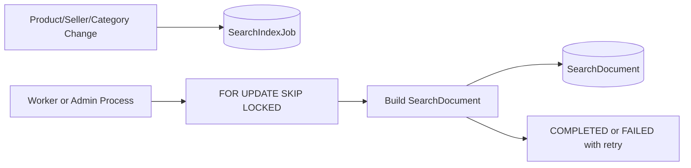

`GET /api/products` remains backward compatible for existing product-list pages. New advanced search UI and suggestions use `GET /api/search` and `GET /api/search/suggestions`.

### 3.3 Product Search Text

The `Product.searchText` column is still generated when sellers create or update products.

It is built from:

- Product name.
- Product description.
- String and number product attributes.

It remains useful as one source field for product search-document generation.

### 3.4 Seller and Admin Product Search

Seller and admin product list pages do not use the public full-text raw SQL path.

They use Prisma filters:

```text
name contains search OR
description contains search OR
searchText contains search
```

They also apply page-specific filters such as seller ID, category ID, product status, and approval status.

### 3.5 Location Search

Location search is backed by location tables:

- `LocationCountry`
- `LocationSubdivision`
- `LocationCity`
- `LocationArea`

Local-area search normalizes display labels. For example:

```text
Mettu Street (636001)
```

becomes search terms:

```text
Mettu Street
636001
```

Then the API searches:

- Area name.
- Postal code.
- Area code.

### 3.6 Other Search Surfaces

Other searches are filtered list queries, mainly `contains` filters over indexed fields.

| Area | Search Fields |
|---|---|
| Orders | Order number |
| Delivery partners | Email, phone, full name |
| Courier shipments | AWB number, provider order ID, shipment number, order number |
| COD remittances | AWB, remittance reference, report reference, shipment number, order number |
| Admin users | Email, phone, full name |
| Admin customers | Display name, email, phone |
| Admin sellers | Store name, slug, email, contact name, legal name, GST, PAN |
| B2B buyers | Company name, GST, contact name, email |
| B2B enquiries | Message, company, product, store |
| Finance payouts | Payout number, store name, transaction reference |
| Finance ledger | Description, reference ID, payout number |
| Seller statements | Statement number, store name, payout number |
| HSN master | HSN code, description, category |
| CMS and SEO | Title, slug, route path, public ID, focus keyword |
| Support | Name, email, subject |
| Email templates/logs | Code, name, subject, recipient |

### 3.7 PostgreSQL Advanced Search Path

The selected advanced search implementation is PostgreSQL-only.

No Redis dependency is used for:

- Search indexing jobs.
- Search response cache.
- Search rate-limit counters.
- Search suggestions.

Large-traffic protection is handled by:

- Nginx/CDN `limit_req` in front of `/api/search` and `/api/search/suggestions`.
- Optional Nginx anonymous GET micro-cache with `proxy_cache_lock`.
- App-level process-local limits as a secondary guard.
- PostgreSQL GIN/trigram indexes, statement timeout, cursor pagination, and strict request budgets.

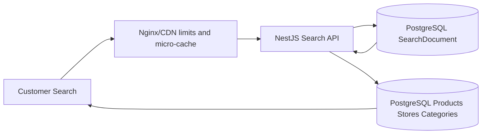

Admin full reindex is exposed through the admin search endpoints and writes audit logs. Search query plans can be inspected through the admin `EXPLAIN` endpoint before production traffic is opened.

## 4. Complete Database Design Wireflow

The diagrams below combine real Prisma relationships with business-flow arrows. The table registry in each section lists the actual schema tables; arrows such as checkout to order or country to currency rate describe the application flow, not always a direct foreign-key column.

### 4.1 Full Business Flow

```mermaid
flowchart TB
  User[User] --> Customer[Customer]
  User --> Seller[Seller]
  User --> BusinessBuyer[BusinessBuyer]
  User --> AdminSession[AdminSession]
  User --> DeliveryPartnerProfile[DeliveryPartnerProfile]
  User --> UserRole[UserRole]
  UserRole --> Role[Role]
  Role --> RolePermission[RolePermission]
  RolePermission --> Permission[Permission]

  Seller --> SellerProfile[SellerProfile]
  Seller --> SellerAddress[SellerAddress]
  Seller --> SellerDocument[SellerDocument]
  Seller --> Product[Product]
  Seller --> SellerPayoutProfile[SellerPayoutProfile]
  Seller --> SellerSubscription[SellerSubscription]

  Category --> Product
  ProductTemplate --> Category
  ProductTemplate --> ProductTemplateField[ProductTemplateField]
  HsnMaster --> Product
  Product --> ProductImage[ProductImage]
  Product --> ProductVariant[ProductVariant]
  ProductVariant --> InventoryMovement[InventoryMovement]

  Customer --> CustomerAddress[CustomerAddress]
  Customer --> Wishlist[Wishlist]
  Wishlist --> WishlistItem[WishlistItem]
  Product --> WishlistItem
  Customer --> Cart[Cart]
  Cart --> CartItem[CartItem]
  ProductVariant --> CartItem
  Cart --> CheckoutSession[CheckoutSession]
  Customer --> Order[Order]

  Order --> OrderItem[OrderItem]
  Order --> OrderSellerSplit[OrderSellerSplit]
  Order --> OrderShipment[OrderShipment]
  Order --> DeliveryDetail[DeliveryDetail]
  Order --> Payment[Payment]
  Order --> OrderStatusEvent[OrderStatusEvent]
  Payment --> PaymentEvent[PaymentEvent]

  OrderSellerSplit --> SellerPayout[SellerPayout]
  SellerPayout --> SellerPayoutEvent[SellerPayoutEvent]
  SellerPayout --> SellerLedgerEntry[SellerLedgerEntry]
  SellerPayout --> SellerStatement[SellerStatement]
  SellerSettlementRun[SellerSettlementRun] --> SellerPayout

  BusinessBuyer --> BusinessBuyerAddress[BusinessBuyerAddress]
  BusinessBuyer --> B2BEnquiry[B2BEnquiry]
  Product --> B2BEnquiry
  Seller --> B2BEnquiry
  B2BEnquiry --> B2BEnquiryResponse[B2BEnquiryResponse]

  NotificationTemplate[NotificationTemplate] --> EmailTriggerRule[EmailTriggerRule]
  EmailTheme[EmailTheme] --> NotificationTemplate
  EmailTriggerRule --> NotificationLog[NotificationLog]
  User --> NotificationLog

  User --> SupportRequest[SupportRequest]
  User --> AuditLog[AuditLog]
```

### 4.2 Identity and Access

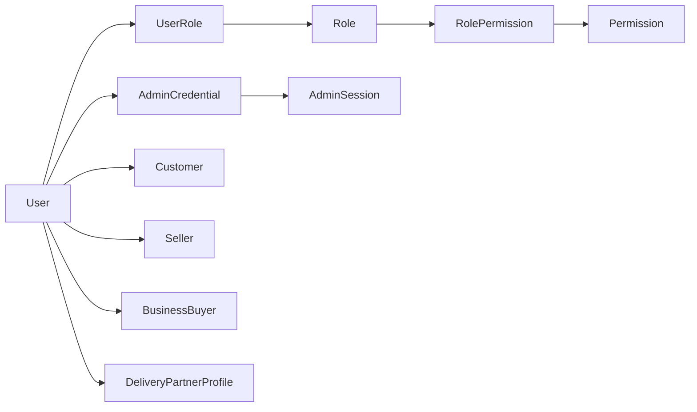

Tables:

| Table | Purpose |
|---|---|
| `User` | Platform user mapped to Clerk where applicable |
| `Role` | Role codes such as customer, seller, admin, finance, delivery |
| `Permission` | Fine-grained permission records |
| `UserRole` | Many-to-many user-role assignment |
| `RolePermission` | Many-to-many role-permission assignment |
| `AdminCredential` | Standalone admin/finance password credentials |
| `AdminSession` | DB-backed admin/finance session tokens |

### 4.3 Customer, Wishlist, Cart, and Checkout

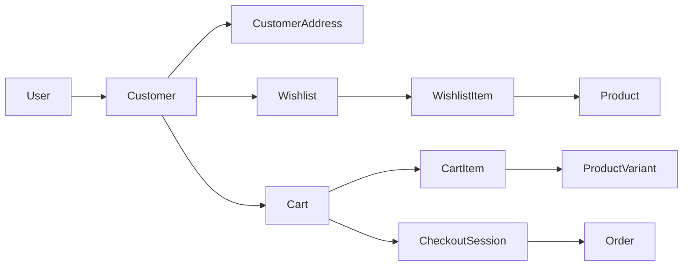

Tables:

| Table | Purpose |
|---|---|
| `Customer` | Customer profile linked to `User` |
| `CustomerAddress` | Delivery address and normalized country/state/city/local area codes |
| `Wishlist` | One wishlist per customer |
| `WishlistItem` | Product saved by customer |
| `Cart` | Active/completed cart |
| `CartItem` | Product variant, seller, quantity, price snapshot |
| `CheckoutSession` | Checkout progress and address/payment snapshots |

### 4.4 Seller, KYC, Subscription, and Payout Profile

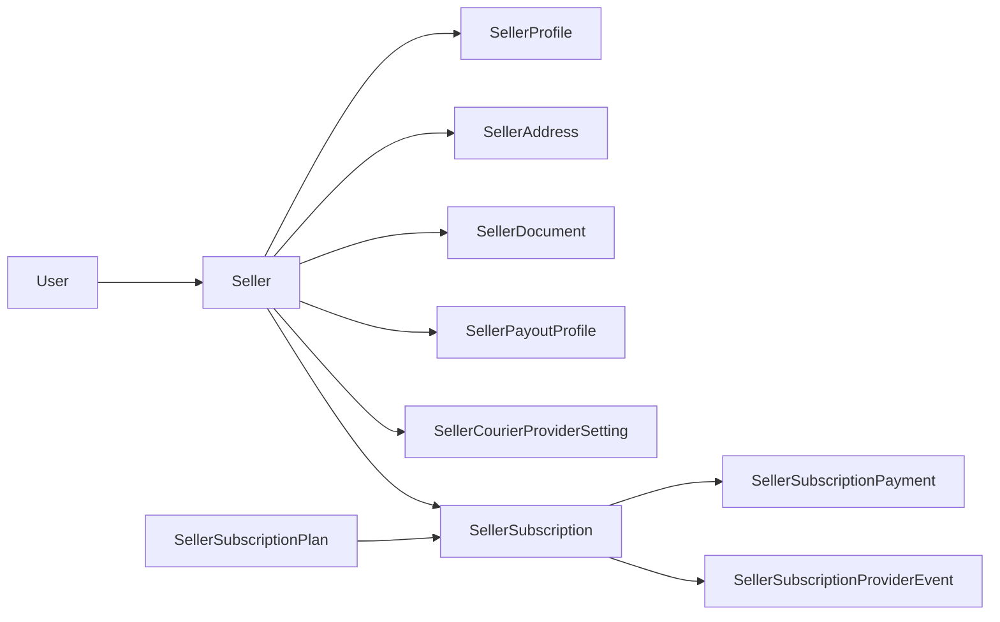

Tables:

| Table | Purpose |
|---|---|
| `Seller` | Store identity, approval, commission, subscription summary |
| `SellerProfile` | Logo, banner, business/KYC contact details |
| `SellerAddress` | Pickup/store address and location codes |
| `SellerDocument` | KYC document references |
| `SellerPayoutProfile` | Bank/UPI payout details |
| `SellerCourierProviderSetting` | Seller-specific courier provider setup |
| `SellerSubscriptionPlan` | Admin-managed seller plans |
| `SellerSubscription` | Seller plan subscription lifecycle |
| `SellerSubscriptionPayment` | Seller recurring plan payment records |
| `SellerSubscriptionProviderEvent` | Provider webhook/event audit for subscriptions |

### 4.5 Catalogue and Inventory

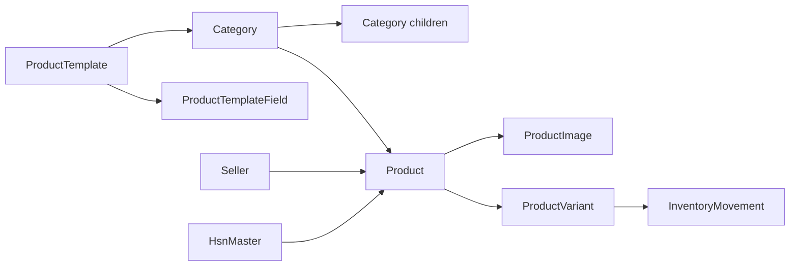

Tables:

| Table | Purpose |
|---|---|
| `Category` | Category tree, tax defaults, product template link |
| `HsnMaster` | HSN/GST catalog suggestions |
| `ProductTemplate` | Dynamic product field template |
| `ProductTemplateField` | Field definitions for template attributes |
| `Product` | Seller product listing, approval, search text, tax fields |
| `ProductImage` | Product images and primary image ordering |
| `ProductVariant` | SKU, price, MRP, stock, package dimensions |
| `InventoryMovement` | Stock movement history |

### 4.6 Orders, Payments, Delivery, and Courier

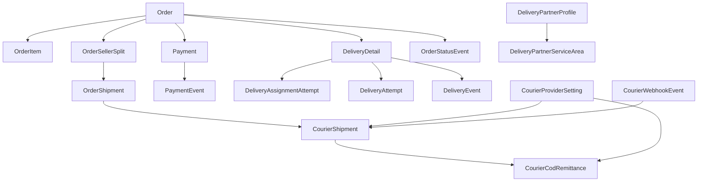

Tables:

| Table | Purpose |
|---|---|
| `Order` | Customer order header, totals, FX snapshot, fee snapshot |
| `OrderItem` | Item-level product, variant, seller, price snapshot |
| `OrderSellerSplit` | Per-seller financial split and settlement eligibility |
| `OrderShipment` | Per-seller shipment, delivery mode, assignment, COD status |
| `OrderStatusEvent` | Order/seller/delivery timeline event |
| `DeliveryDetail` | Order-level delivery assignment and tracking |
| `DeliveryAssignmentAttempt` | Assignment attempt to delivery partner |
| `DeliveryPartnerProfile` | Delivery partner capacity, location, COD limits |
| `DeliveryPartnerServiceArea` | Detailed partner service area rules |
| `DeliveryAttempt` | Failed/rescheduled delivery attempt |
| `DeliveryTrackingCounter` | Date-based tracking number sequence |
| `DeliveryEvent` | Delivery status timeline |
| `Payment` | Payment provider, method, amount, state, provider IDs |
| `PaymentEvent` | Payment state changes and raw provider payloads |
| `ShippingRateCard` | Manual shipping and COD surcharge rules |
| `CourierProviderSetting` | Future/live courier provider settings |
| `CourierShipment` | Courier booking/tracking data |
| `CourierWebhookEvent` | Raw courier webhook records |
| `CourierCodRemittance` | Courier COD settlement/remittance verification |

### 4.7 Finance, Settlement, and Ledger

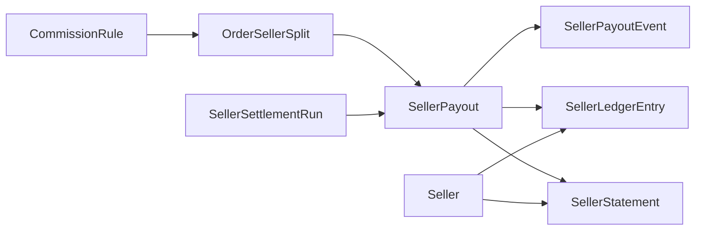

Tables:

| Table | Purpose |
|---|---|
| `CommissionRule` | Seller/category/global commission, GST, TDS, TCS, platform fee rules |
| `SellerSettlementRun` | Batch settlement summary |
| `SellerPayout` | Seller payout request/approval/payment record |
| `SellerPayoutEvent` | Payout lifecycle timeline |
| `SellerLedgerEntry` | Append-only seller ledger entries |
| `SellerStatement` | Seller statement snapshots |

### 4.8 B2B Buyer and Enquiry Flow

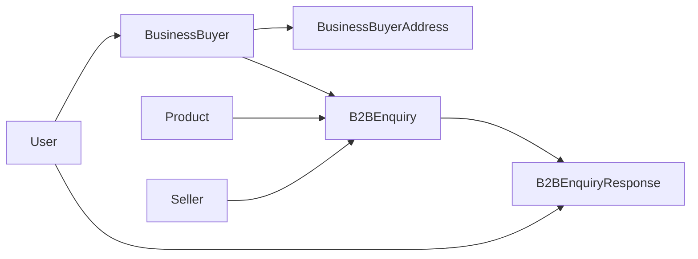

Tables:

| Table | Purpose |
|---|---|
| `BusinessBuyer` | Company buyer profile linked to `User` |
| `BusinessBuyerAddress` | Procurement address |
| `B2BEnquiry` | Product/store/bulk enquiry and status |
| `B2BEnquiryResponse` | Seller/admin response and quoted price |

### 4.9 Locations and Market Currency

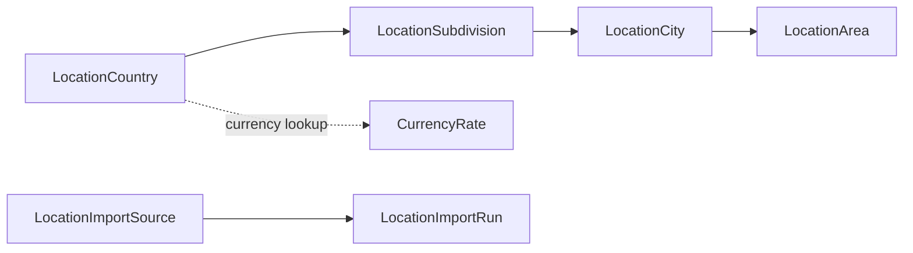

Tables:

| Table | Purpose |
|---|---|
| `LocationCountry` | Enabled countries, currency, locale, postal-code rules |
| `LocationSubdivision` | State/province records |
| `LocationCity` | City/district records |
| `LocationArea` | Local area and pincode/postal-code records |
| `LocationImportSource` | Data source configuration |
| `LocationImportRun` | Import run metrics and status |
| `CurrencyRate` | DB-backed FX cache, not in-memory cache |

### 4.10 CMS, Support, Notifications, Settings, and Audit

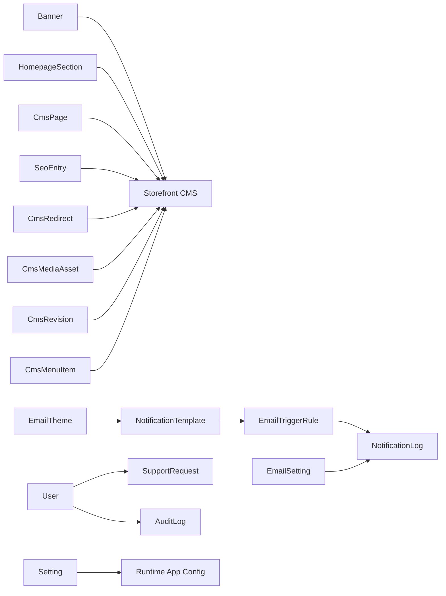

Tables:

| Table | Purpose |
|---|---|
| `Banner` | Homepage hero/banner records |
| `CmsPage` | Policy and content pages |
| `HomepageSection` | Configured storefront homepage sections |
| `SeoEntry` | SEO metadata by entity/route |
| `CmsRedirect` | Redirect rules |
| `CmsMediaAsset` | CMS media records |
| `CmsRevision` | CMS revision snapshots |
| `CmsMenuItem` | Header/footer menu tree |
| `SupportRequest` | Contact/support submissions |
| `NotificationTemplate` | Email template content |
| `EmailTriggerRule` | Event-to-template routing |
| `EmailTheme` | Email template theme tokens |
| `NotificationLog` | Durable email/notification log |
| `EmailSetting` | Email provider and sender configuration |
| `Setting` | Platform settings as typed JSON |
| `AuditLog` | Sensitive action audit trail |

## 5. Main End-To-End Wireflows

### 5.1 Seller Product Approval

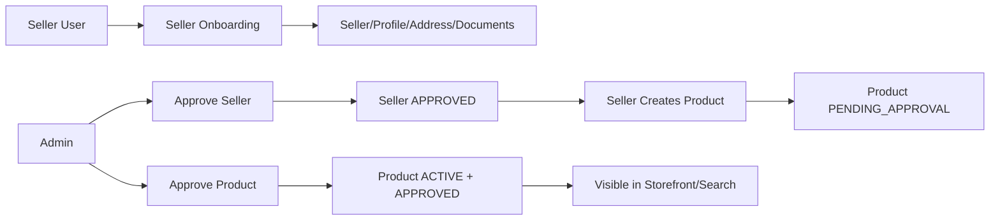

### 5.2 Customer Order and Seller Split

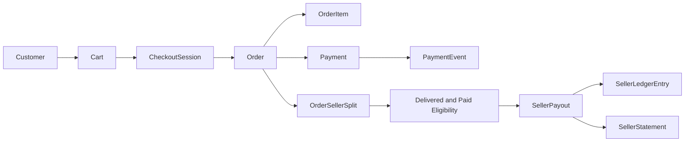

### 5.3 Delivery and COD Verification

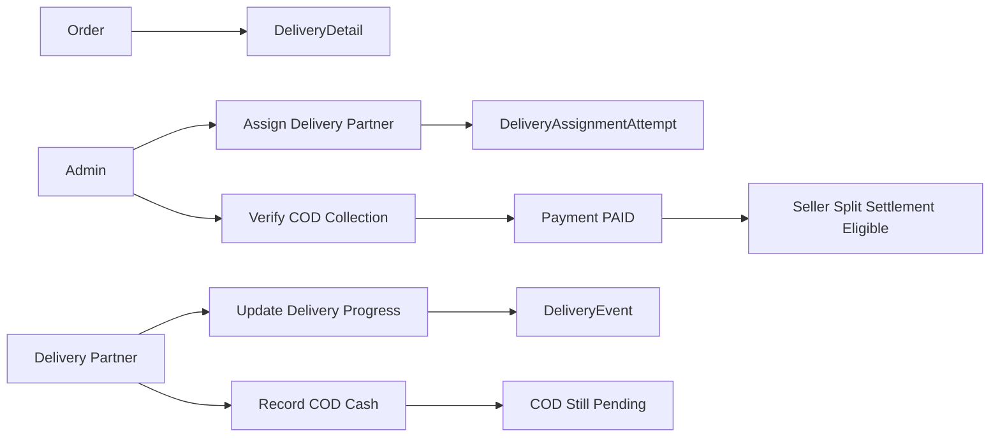

### 5.4 Notification Queue

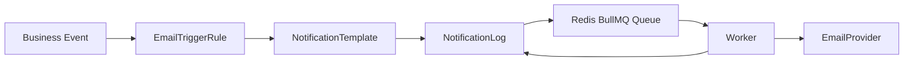

## 6. Practical Explanation For The Project

Use this wording when explaining the architecture:

```text
The project uses PostgreSQL as the permanent source of truth. In-memory state is limited to temporary runtime caches, browser query caching, API rate-limit buckets, and Redis/BullMQ queue memory for background email jobs. Current product search is handled directly in PostgreSQL using full-text ranking and indexed filters. The database is designed around multi-role users, sellers, products, carts, orders split by sellers, payments, delivery, COD verification, B2B enquiries, finance settlement, CMS, notifications, settings, and audit logs.
```

## 7. Production Notes

- Do not store user, seller, payment, payout, cart, order, or approval state only in memory.
- Move process-local rate limits to Redis if the API runs on multiple instances.
- Keep Redis queue payloads minimal and non-secret.
- Keep provider secrets in environment variables or admin-managed secure settings, not in public responses.
- Keep search source data in PostgreSQL first.
- Keep selected advanced marketplace search on PostgreSQL search documents, GIN indexes, trigram indexes, and DB-backed indexing jobs unless the product owner explicitly approves a separate search-engine migration later.
- Keep all money fields in minor units, such as paise, as the schema already does.
- Keep audit logs for admin, seller, product, order, delivery, finance, settings, and policy-sensitive actions.
